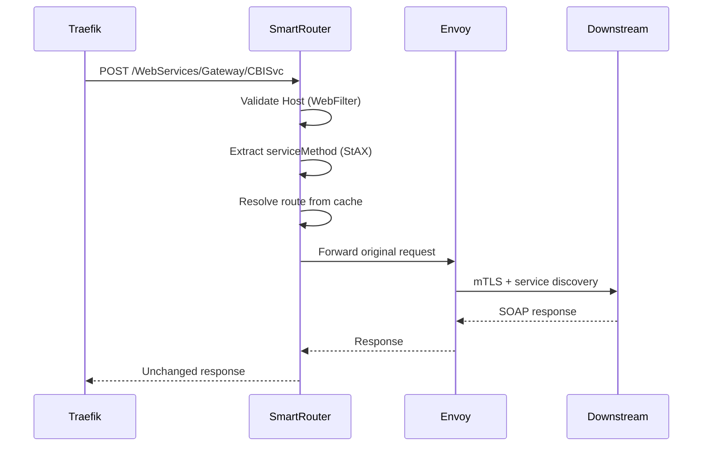

# Gateway Support Service (Smart Router)

Production-ready Spring Boot reactive service that routes SOAP/XML gateway requests to downstream Spring Boot microservices via Consul Connect Envoy sidecar.

Traefik acts as the API Gateway. This service is a **Smart Router** only — it validates hosts, extracts `serviceMethod` from XML, resolves the target service, and forwards the original request unchanged.

## Technology Stack

- Java 25
- Spring Boot 4.0.6
- Spring WebFlux / Reactor Netty
- WebClient
- StAX (`XMLStreamReader`)
- Maven

## Quick Start

```bash
mvn spring-boot:run
```

```bash
mvn test
```

## Endpoint

**POST** `/WebServices/Gateway/CBISvc`

**Content-Type:** `text/xml` or `application/soap+xml`

### Example Request

```xml
<Request>
    <serviceMethod>getCustomer</serviceMethod>
</Request>
```

## Request Flow



1. **Host validation** — `/WebServices/*` requests validate the `Host` header against an in-memory cache
2. **Client IP resolution** — `X-Forwarded-For` → `X-Real-IP` → Remote Address
3. **XML parsing** — StAX streaming parser extracts `serviceMethod` and stops immediately
4. **Routing** — Resolves target service from YAML or Consul KV cache
5. **Forwarding** — WebClient streams the original body to `http://{serviceName}{path}` via Envoy
6. **Response** — Returns downstream status, headers, and body unchanged

## Configuration

### Routing Provider

```yaml
routing:
  provider: yaml   # or consul
```

**YAML routes** (`application.yml`):

```yaml
routes:
  getCustomer: customer-service
  createCustomer: customer-write-service
  makePayment: payment-service
  issuePolicy: policy-service
```

**Consul KV** (placeholder with extension points in `ConsulRoutingProvider`):

```yaml
routing:
  provider: consul
  consul:
    key-prefix: gateway/routes
    poll-interval-ms: 30000
```

### Forwarding

```yaml
forwarding:
  service-url-pattern: "http://{serviceName}"
  connect-timeout-ms: 5000
  read-timeout-ms: 30000
  max-connections: 200
```

The `{serviceName}` placeholder is replaced with the resolved Consul service name. Envoy handles service discovery, mTLS, and load balancing.

### Allowed Hosts

Loaded from DB2 via `AllowedHostRepository` (mock implementation provided). Cache reload:

- On startup
- Every hour (`allowed-hosts.reload-cron`)
- Manual: **POST** `/admin/cache/allowed-hosts/reload`

## Project Structure

```
src/main/java/com/gateway/smartrouter/
├── config/           # Configuration properties and beans
├── controller/       # Gateway and admin endpoints
├── filter/           # AllowedHostWebFilter, ClientIpResolver
├── parser/           # ServiceMethodExtractor (StAX)
├── repository/       # AllowedHostRepository + mock DB2 impl
├── routing/          # YamlRoutingProvider, ConsulRoutingProvider, RoutingCache
├── service/          # AllowedHostService, RequestForwardingService
└── exception/        # Error handling
```

## Admin API

| Method | Path | Description |
|--------|------|-------------|
| POST | `/admin/cache/allowed-hosts/reload` | Reload allowed host cache from DB2 |

## Production Notes

- Replace `MockAllowedHostRepository` with a real DB2 implementation
- Integrate a Consul KV client in `ConsulRoutingProvider.fetchRoutesFromConsul()`
- Deploy inside Consul Connect with Envoy sidecar for downstream calls
- Configure Traefik to route gateway traffic to this service
